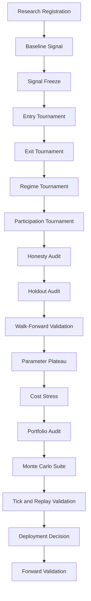

# Quant Research Pipeline

[](https://github.com/weston-boyd/quant-research-pipeline/actions/workflows/tests.yml)
[](https://www.python.org/)
[](LICENSE)

A structured Python framework for managing quantitative strategy research from hypothesis registration through deployment readiness and forward validation.

Quant Research Pipeline provides dependency-aware validation stages, persistent pipeline state, standardized artifact directories, evidence discovery and review, legacy artifact migration, command-line validation, and explicit deployment decisions.

It does not implement trading signals, broker connectivity, or a backtesting engine. It provides the orchestration and evidence layer around those systems.

## Why this exists

Quantitative research often breaks down because the process itself is not controlled. Signal definitions change during optimization, holdout data stops being untouched, execution assumptions remain undocumented, failed experiments disappear, and deployment decisions become subjective.

Quant Research Pipeline treats research methodology as software infrastructure.

## Research lifecycle



## Installation

```powershell
git clone https://github.com/weston-boyd/quant-research-pipeline.git
cd quant-research-pipeline
python -m venv .venv
.\.venv\Scripts\Activate.ps1
python -m pip install --upgrade pip
pip install -e ".[dev]"
```

## Quick start

```python
from quant_research_pipeline import (
    ResearchManifest,
    SamplePeriod,
    StageRegistry,
    initialize_research_program,
)

registry = StageRegistry()

manifest = ResearchManifest(
    research_id="example-breakout-v1",
    strategy_family="intraday_breakout",
    strategy_version="1.0.0",
    universe=["ES", "NQ"],
    timeframe="5min",
    development_period=SamplePeriod("2021-01-01", "2023-12-31"),
    holdout_period=SamplePeriod("2024-01-01", "2024-12-31"),
    data_source="normalized-futures-bars",
    cost_model_id="futures-standard-v1",
    output_root="research/example-breakout-v1",
    hypothesis="Opening-range expansion may persist under suitable market conditions.",
    required_stages=list(registry.stage_ids()),
    directions=["long", "short"],
)

initialize_research_program(manifest)
```

## Command-line interface

```powershell
quant-research --help
quant-research status research/example-breakout-v1
quant-research next research/example-breakout-v1
quant-research validate research/example-breakout-v1
quant-research artifacts research/example-breakout-v1
```

Additional commands support legacy migration, evidence indexing, and formal evidence review.

## Canonical validation stages

1. Research Registration
2. Baseline Signal Test
3. Signal Freeze
4. Entry Architecture Tournament
5. Exit Architecture Tournament
6. Regime Tournament
7. Participation Tournament
8. Honesty Audit
9. Development vs Holdout Audit
10. Walk-Forward Validation
11. Parameter Plateau Audit
12. Execution-Cost Stress
13. Portfolio Risk Audit
14. Monte Carlo Suite
15. Tick and Replay Validation
16. Deployment Readiness Decision
17. Forward Validation

See [Architecture](docs/architecture.md) for details.

## Testing

```powershell
pytest -q
pytest --cov=quant_research_pipeline --cov-report=term-missing
```

## Project status

- 17 canonical research stages
- public Python API
- installed command-line interface
- artifact registry
- evidence indexing and review
- legacy migration support
- 37 automated tests

## License

Released under the [MIT License](LICENSE).
